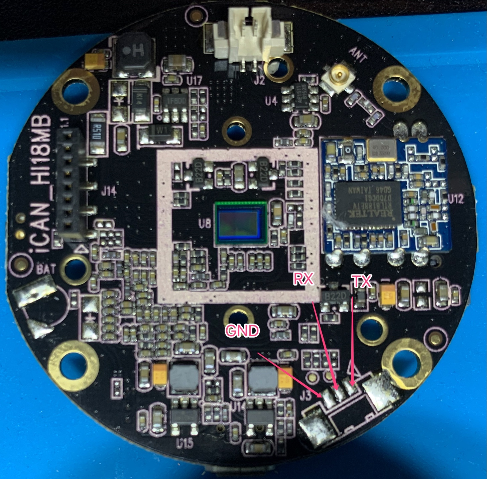

# HackBoyunIPCamera

> 博客文章：[也折腾博云物联辣鸡网络摄像头（上）](https://www.tylinux.com/post/hack_boyun_ipcamera_01/)
## Spec

| Feature                 | Specification                     |
| :---------------------- | :-------------------------------- |
| SoC                     | HI3518CV100, ARM926EJ-S@100Mh     |
| Memory                  | 40 MB                             |
| Flash                   | W25Q64FV 8MB NOR Flash            |
| Sensor                  | OV9712 720P/30Hz image Sensor     |
| WiFi Module             | Realtek RTL8188ETV 802.11 b/g/n   |

## TTL

## Datasheets

[Hi3518E 720p IP Camera SoC Data Sheet.pdf](./Docs/Hi3518E%20720p%20IP%20Camera%20SoC%20Data%20Sheet.pdf)

## Images

1. [orignal_bakcup](./Firmwares/hi3518cv100_backup.bin)
2. [orignal uboot with OpenIPC kernel](./Firmwares/new.bin)

## TODO

1. [ ] OpenIPC U-Boot 适配
2. [ ] 驱动 WiFi 模块
3. [ ] 正确识别 Sensor

## Reference

1. https://www.mydigit.cn/forum.php?mod=viewthread&tid=255164
2. https://github.com/felix-001/hackboyun/blob/develop/doc/Boyun_FlashFirmware.md
3. https://github.com/OpenIPC/chaos_calmer
